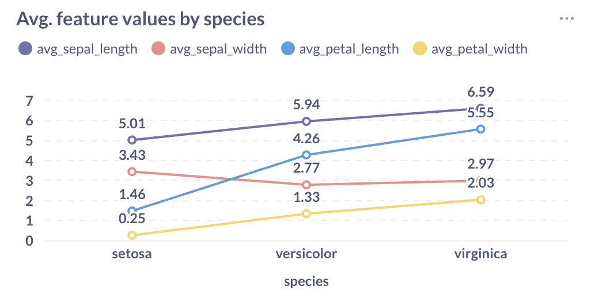
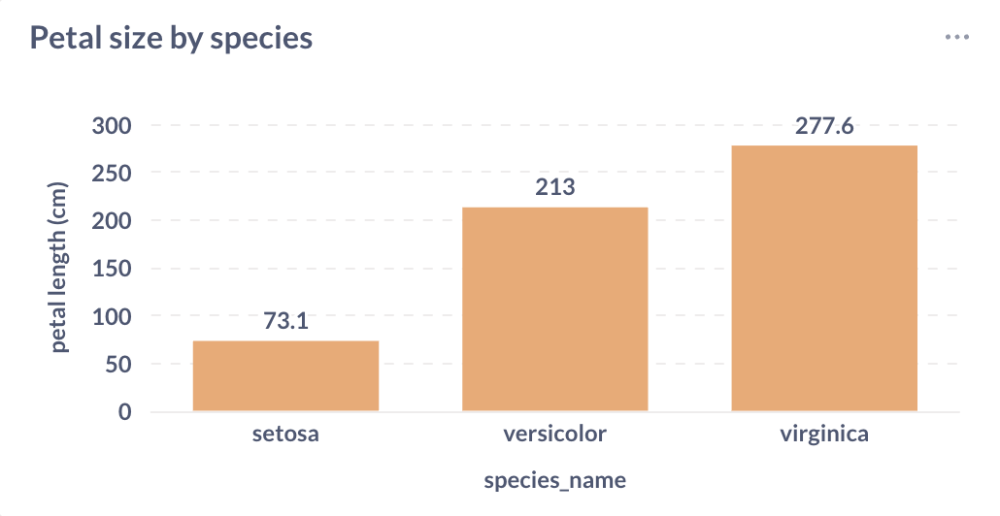
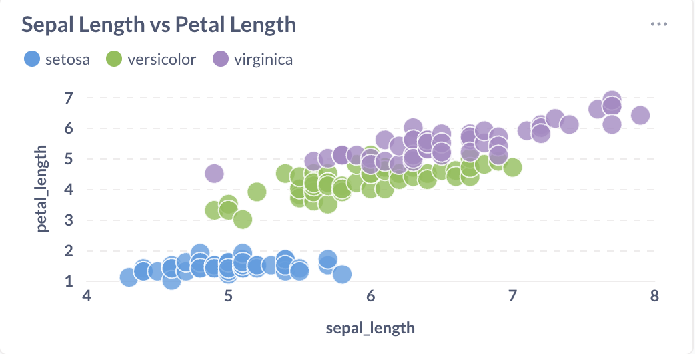
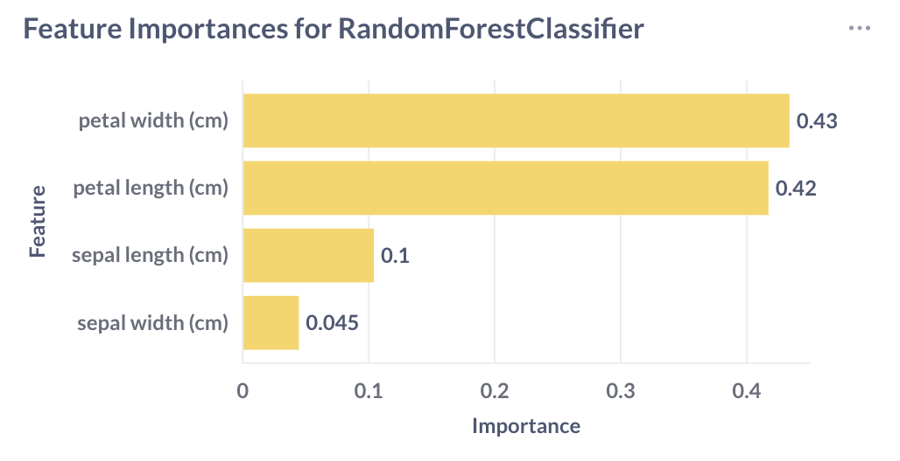

# Iris Classification Project

## Краткое описание
Проект предназначен для сравнения моделей машинного обучения на датасете Iris. В проекте реализованы:

- Сравнение моделей `LogisticRegression`, `Decision Tree` и `Random Forest`.
- Обучение и оценка `RandomForestClassifier` с сохранением важности признаков.
- Работа с данными через CSV и SQLite базу.
- Визуализация данных и результатов моделей через Metabase.

Проект позволяет быстро оценить производительность разных моделей и загрузить данные для дальнейшего анализа.

---

## Используемые библиотеки
- `pandas`
- `numpy`
- `scikit-learn`
- `sqlite3`
- `matplotlib` (для визуализации, если требуется)
- `jupyter` / `notebook`

Установить зависимости можно командой:

```bash
pip install -r requirements.txt
```

---

## Клонирование репозитория

```bash
git clone https://github.com/Kidukwe/iris-classification.git
cd iris-classification
```

---

## Структура проекта 

```bash
Iris_Classification/
├── data/
│   ├── iris_data.csv             # Исходный CSV с данными Iris
│   ├── iris_data.db              # SQLite база с импортированными данными
│   ├── import_iris.py            # Скрипт для импорта CSV в SQLite
│   └── feature_importances.csv   # Сохранённая важность признаков
├── notebooks/
│   ├── iris_classification.ipynb             # Основной ноутбук с базовым анализом
│   ├── iris_DecisionTreeClassifier.ipynb     # Обучение Decision Tree
│   ├── iris_LogisticRegression.ipynb         # Обучение Logistic Regression
│   ├── iris_RandomForestClassifier.ipynb     # Обучение RandomForestClassifier и сохранение feature importance
│   ├── iris_comparing_LR_and_DTC.ipynb       # Сравнение LogisticRegression и Decision Tree
│   └── iris_comparing_models.ipynb           # Сравнение всех моделей
├── Iris_Classification.code-workspace        # VSCode workspace
├── requirements.txt                          # Список зависимостей Python
└── README.md
```

---

## Запуск ноутбуков

### 1. Сравнение моделей
Откройте notebooks/iris_comparing_models.ipynb в Jupyter Notebook и выполните все ячейки.
Результатом будет DataFrame с точностью моделей:
```bash
| Model               | Accuracy |
|--------------------|----------|
| LogisticRegression  | 0.9111   |
| Decision Tree       | 1.0000   |
| Random Forest       | 1.0000   |
```

### 2. RandomForestClassifier
Откройте notebooks/iris_RandomForestClassifier.ipynb и выполните все ячейки.
Действия ноутбука:
- Обучение модели RandomForestClassifier
- Расчет точности и отчета классификации
- Сохранение важности признаков в CSV (data/feature_importances.csv)
Пример feature_importances.csv:
```text
feature  importance
0   petal width (cm)    0.433982
1  petal length (cm)    0.417308
2  sepal length (cm)    0.104105
3   sepal width (cm)    0.044605
```

### 3. Сравнение LogisticRegression и Decision Tree
Откройте notebooks/iris_comparing_LR_and_DTC.ipynb для быстрого сравнения этих двух моделей.

## Использование import_iris.py
Для импорта данных из CSV в SQLite выполните:

```bash
python data/import_iris.py
```

После выполнения будет создана база data/iris_data.db с таблицей iris, содержащей данные из CSV.
Пример запроса к базе:

```python 
import sqlite3
import pandas as pd

conn = sqlite3.connect("data/iris_data.db")
df = pd.read_sql_query("SELECT * FROM iris LIMIT 5;", conn)
print(df)
```
Пример вывода данных:

```bash
   sepal length (cm)  sepal width (cm)  petal length (cm)  petal width (cm) species
0                5.1               3.5                1.4               0.2  setosa
1                4.9               3.0                1.4               0.2  setosa
2                4.7               3.2                1.3               0.2  setosa
3                4.6               3.1                1.5               0.2  setosa
4                5.0               3.6                1.4               0.2  setosa
```

## Скриншоты Metabas

### 1. Анализ изначальных данных из iris_data (внутри iris_data.db)




### 2. Значимые признаки для обучения модели RFC ()


## PS
- iris_data.csv используется для обучении моделей, а iris_data.db - работы в Database
- В iris_data.db две таблицы iris и iris_data, то есть не нужно искать причины этому, так как они одинаковы